### Activity Diagrams

#### Use Case UC-1: Sign Up

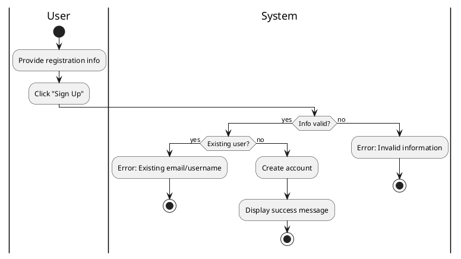

#### Use Case UC-2: Sign In

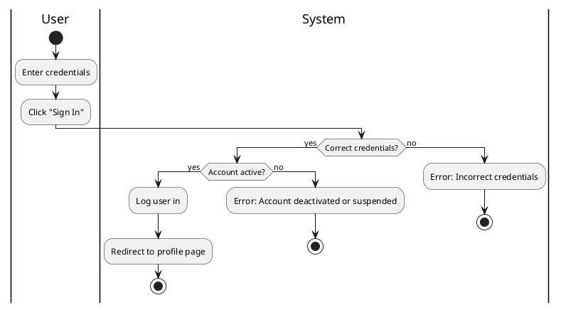

#### Use Case UC-3: View Profile

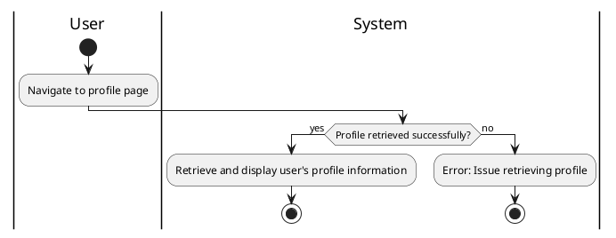

#### Use Case UC-4: Create Post

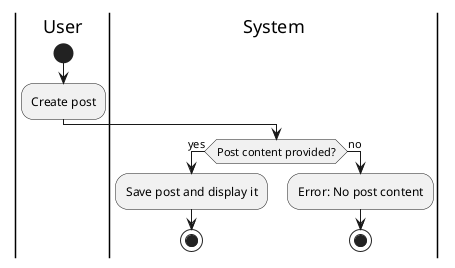

#### Use Case UC-5: Search

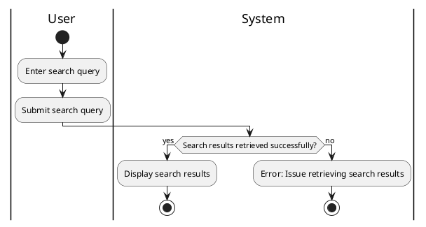

#### Use Case UC-6: View Notifications

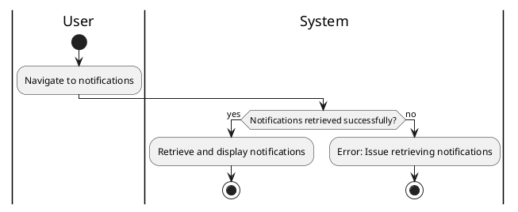

#### Use Case UC-7: Follow User

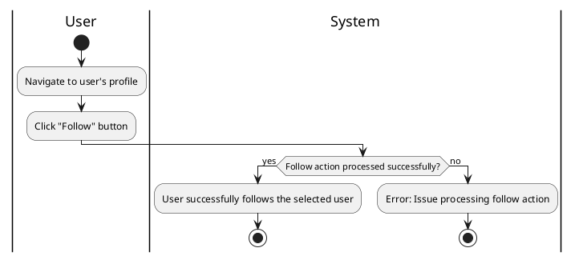

#### Use Case UC-8: Unfollow User

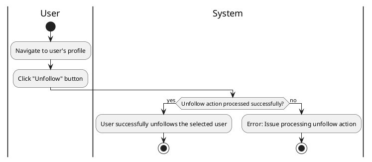

#### Use Case UC-9: Update Profile

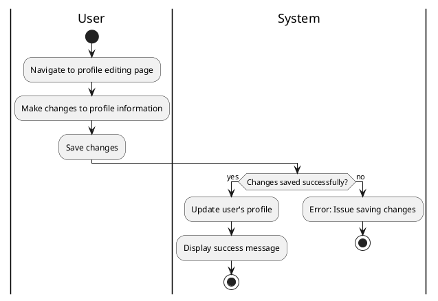

#### Use Case UC-10: View Post

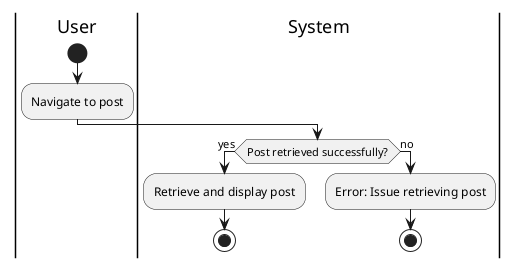

#### Use Case UC-11: Edit Post

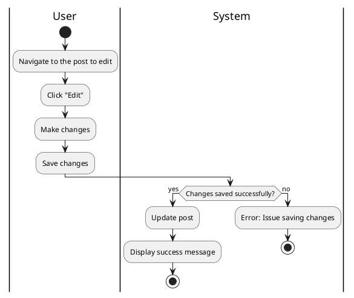

#### Use Case UC-12: Delete Post

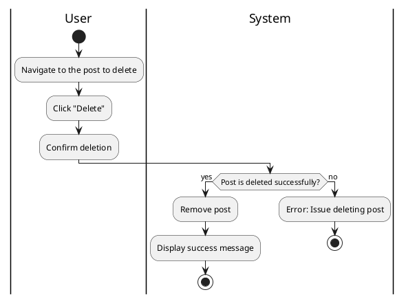

#### Use Case UC-13: Comment on Post

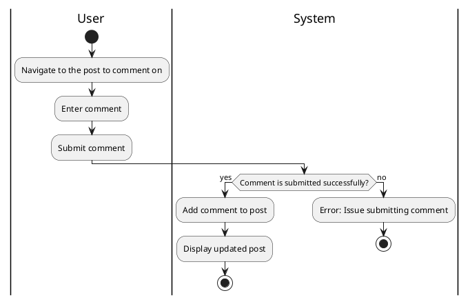

#### Use Case UC-14: Edit Comment


#### Use Case UC-15: Delete Comment

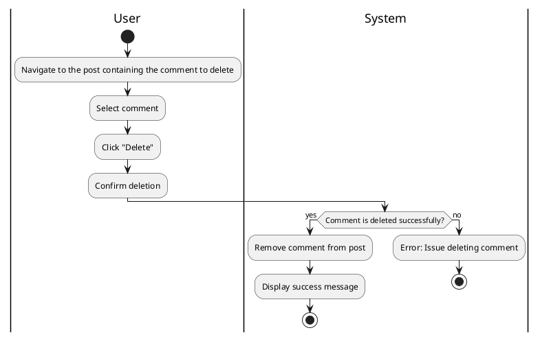

#### Use Case UC-16: React to Post

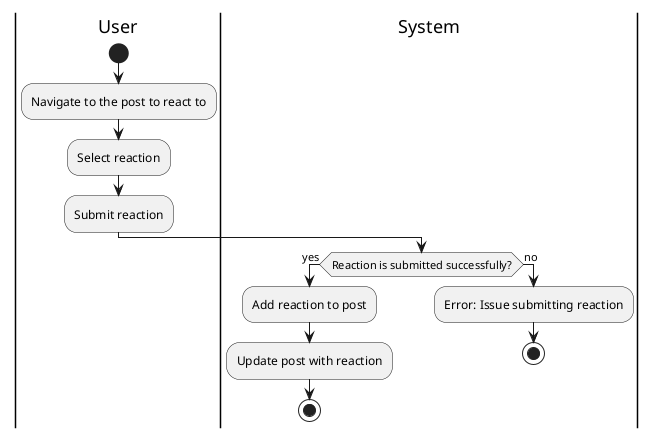

#### Use Case UC-17: Remove Reaction

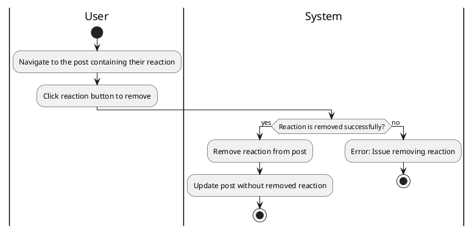

#### Use Case UC-18: Send Message

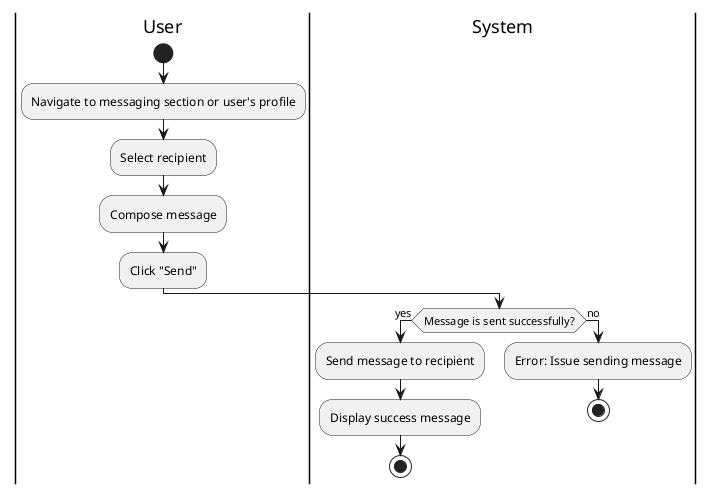

#### Use Case UC-19: View Messages

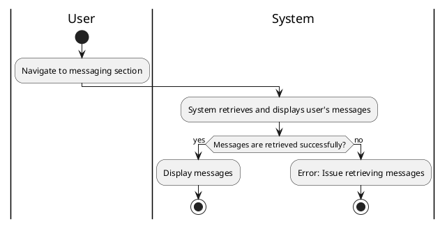

#### Use Case UC-20: Edit Message

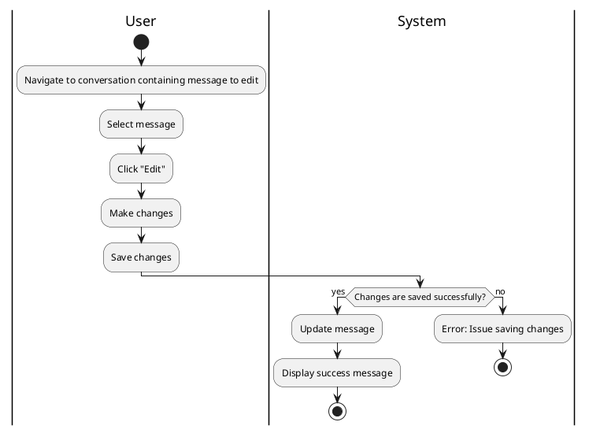

#### Use Case UC-21: Delete Message

```plantuml
@startuml
|User|
start
:Navigate to conversation containing message to delete;
:Select message;
:Confirm deletion;
|System|
if (Message is deleted successfully?) then (yes)
  :Remove message from conversation;
  :Display success message;
  stop
else (no)
  :Error: Issue deleting message;
  stop
endif
@enduml

```

#### Use Case UC-22: Delete Notification

```plantuml
@startuml
|User|
start
:Navigate to notification list;
:Select notification to delete;
:Confirm deletion;
|System|
if (Notification is deleted successfully?) then (yes)
  :Remove notification from list;
  :Display success message;
  stop
else (no)
  :Error: Issue deleting notification;
  stop
endif
@enduml

```
