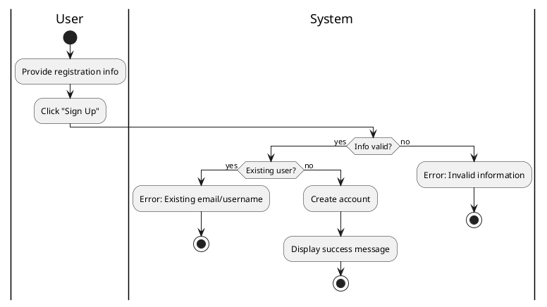

#### Use Case UC-1: Sign Up
| ID & Name:         | UC-1: Sign Up                                                                                                                                                                                                                                                                                                               |
| ------------------ | --------------------------------------------------------------------------------------------------------------------------------------------------------------------------------------------------------------------------------------------------------------------------------------------------------------------------- |
| Primary Actor:     | User                                                                                                                                                                                                                                                                                                                        |
| Description:       | User registers for a new account.                                                                                                                                                                                                                                                                                           |
| Trigger:           | User decides to create a new account.                                                                                                                                                                                                                                                                                       |
| Pre-conditions:    | None.                                                                                                                                                                                                                                                                                                                       |
| Post-conditions:   | User successfully registers for an account.                                                                                                                                                                                                                                                                                 |
| Normal Flow:       | 1. User provides required registration information.   2. User clicks on the "Sign Up" button.   3. System creates a new account for the user.   4. System displays a success message.                                                                                                                              |
| Alternative Flows: | None.                                                                                                                                                                                                                                                                                                                       |
| Exceptions:        | **Exception #1:** User provides incomplete or invalid information.   1. User receives an error message prompting to correct the information.   **Exception #2:** User tries to sign up with an existing email or username.   1. User receives an error message indicating the email or username is already in use. |
| Priority:          | High                                                                                                                                                                                                                                                                                                                        |

