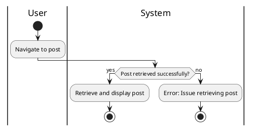

#### Use Case UC-10: View Post
| ID & Name:         | UC-10: View Post                                                                                                                          |
| ------------------ | ----------------------------------------------------------------------------------------------------------------------------------------- |
| Primary Actor:     | User                                                                                                                                      |
| Description:       | User views a post along with its associated comments, reactions, and other details.                                                       |
| Trigger:           | User clicks on a post from the feed or search results.                                                                                    |
| Pre-conditions:    | User is logged into their account.                                                                                                        |
| Post-conditions:   | User successfully views the selected post.                                                                                                |
| Normal Flow:       | 1. User clicks on a post from the feed or search results.   2. System retrieves and displays the selected post along with its details. |
| Alternative Flows: | None.                                                                                                                                     |
| Exceptions:        | **Exception #1:** System encounters an error while retrieving the post.   1. User receives an error message indicating the issue.      |
| Priority:          | High                                                                                                                                      |

