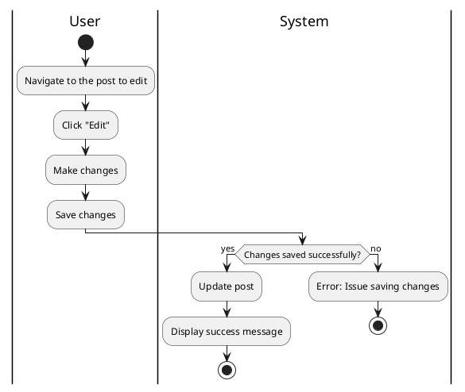

#### Use Case UC-11: Edit Post
| ID & Name:         | UC-11: Edit Post                                                                                                                                                                   |
| ------------------ | ---------------------------------------------------------------------------------------------------------------------------------------------------------------------------------- |
| Primary Actor:     | User                                                                                                                                                                               |
| Description:       | User edits one of their existing posts.                                                                                                                                            |
| Trigger:           | User decides to edit a post they previously created.                                                                                                                               |
| Pre-conditions:    | User is logged into their account.                                                                                                                                                 |
| Post-conditions:   | Post is successfully edited and updated with the new content.                                                                                                                      |
| Normal Flow:       | 1. User navigates to the post they want to edit.   2. User clicks on the "Edit" option.   3. User makes desired changes to the post content.   4. User saves the changes. |
| Alternative Flows: | None.                                                                                                                                                                              |
| Exceptions:        | **Exception #1:** User encounters errors while saving changes.   1. User receives an error message indicating the issue.   2. User retries the save operation.               |
| Priority:          | Medium                                                                                                                                                                             |

