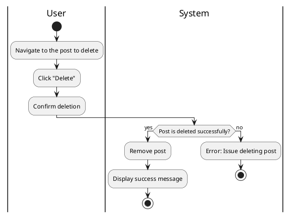

#### Use Case UC-12: Delete Post
| ID & Name:         | UC-12: Delete Post                                                                                                                                                        |
| ------------------ | ------------------------------------------------------------------------------------------------------------------------------------------------------------------------- |
| Primary Actor:     | User                                                                                                                                                                      |
| Description:       | User deletes one of their existing posts.                                                                                                                                 |
| Trigger:           | User decides to delete a post they previously created.                                                                                                                    |
| Pre-conditions:    | User is logged into their account.                                                                                                                                        |
| Post-conditions:   | Post is successfully deleted and removed from the system.                                                                                                                 |
| Normal Flow:       | 1. User navigates to the post they want to delete.   2. User clicks on the "Delete" option.   3. User confirms the deletion.                                        |
| Alternative Flows: | None.                                                                                                                                                                     |
| Exceptions:        | **Exception #1:** User encounters errors while deleting the post.   1. User receives an error message indicating the issue.   2. User retries the delete operation. |
| Priority:          | Medium                                                                                                                                                                    |

