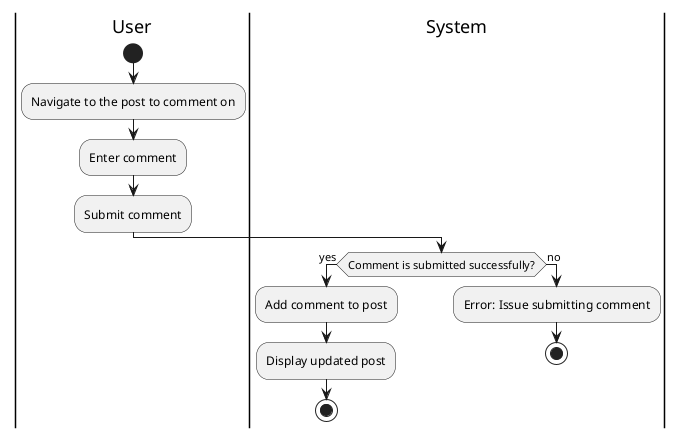

#### Use Case UC-13: Comment on Post
| ID & Name:         | UC-13: Comment on Post                                                                                                                                                       |
| ------------------ | ---------------------------------------------------------------------------------------------------------------------------------------------------------------------------- |
| Primary Actor:     | User                                                                                                                                                                         |
| Description:       | User adds a comment to an existing post.                                                                                                                                     |
| Trigger:           | User decides to comment on a post.                                                                                                                                           |
| Pre-conditions:    | User is logged into their account.                                                                                                                                           |
| Post-conditions:   | Comment is successfully added to the selected post.                                                                                                                          |
| Normal Flow:       | 1. User navigates to the post they want to comment on.   2. User types their comment in the designated comment section.   3. User clicks on the "Post Comment" button. |
| Alternative Flows: | None.                                                                                                                                                                        |
| Exceptions:        | **Exception #1:** User encounters errors while posting the comment.   1. User receives an error message indicating the issue.   2. User retries the comment operation. |
| Priority:          | High                                                                                                                                                                         |

