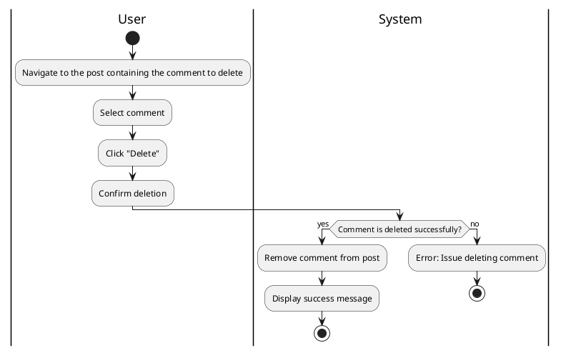

#### Use Case UC-15: Delete Comment
| ID & Name:         | UC-15: Delete Comment                                                                                                                                                        |
| ------------------ | ---------------------------------------------------------------------------------------------------------------------------------------------------------------------------- |
| Primary Actor:     | User                                                                                                                                                                         |
| Description:       | User deletes one of their existing comments on a post.                                                                                                                       |
| Trigger:           | User decides to delete a comment they previously made.                                                                                                                       |
| Pre-conditions:    | User is logged into their account.                                                                                                                                           |
| Post-conditions:   | Comment is successfully deleted and removed from the post.                                                                                                                   |
| Normal Flow:       | 1. User navigates to the comment they want to delete.   2. User clicks on the "Delete" option.   3. User confirms the deletion.                                        |
| Alternative Flows: | None.                                                                                                                                                                        |
| Exceptions:        | **Exception #1:** User encounters errors while deleting the comment.   1. User receives an error message indicating the issue.   2. User retries the delete operation. |
| Priority:          | Medium                                                                                                                                                                       |

