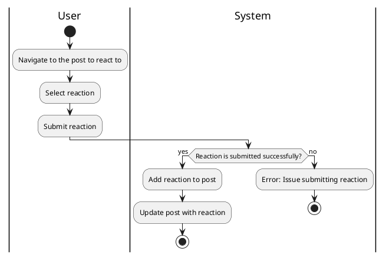

#### Use Case UC-16: React to Post
| ID & Name:         | UC-16: React to Post                                                                                                                                                                                                |
| ------------------ | ------------------------------------------------------------------------------------------------------------------------------------------------------------------------------------------------------------------- |
| Primary Actor:     | User                                                                                                                                                                                                                |
| Description:       | User reacts to a post by adding a like, dislike, or other emotive response.                                                                                                                                         |
| Trigger:           | User decides to react to a post.                                                                                                                                                                                    |
| Pre-conditions:    | User is logged into their account.                                                                                                                                                                                  |
| Post-conditions:   | User's reaction is successfully added to the selected post.                                                                                                                                                         |
| Normal Flow:       | 1. User clicks on the reaction button (e.g., like, dislike) associated with the post.                                                                                                                               |
| Alternative Flows: | None.                                                                                                                                                                                                               |
| Exceptions:        | **Exception #1:** User encounters errors while adding the reaction.   1. User receives an error message indicating the issue.                                         2. User retries the reaction operation. |
| Priority:          | Medium                                                                                                                                                                                                              |

