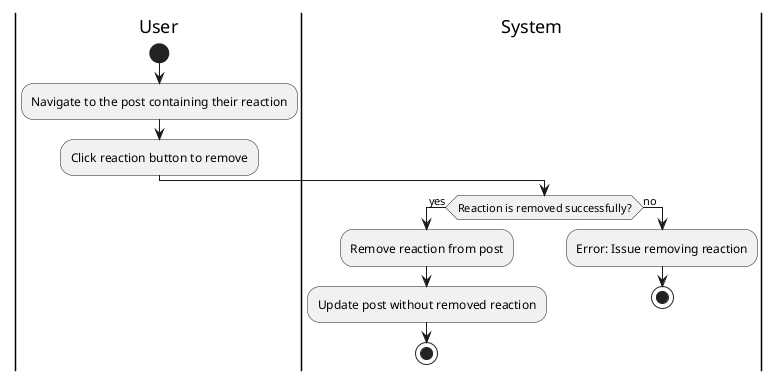

#### Use Case UC-17: Remove Reaction
| ID & Name:         | UC-17: Remove Reaction                                                                                                                                                                                              |
| ------------------ | ------------------------------------------------------------------------------------------------------------------------------------------------------------------------------------------------------------------- |
| Primary Actor:     | User                                                                                                                                                                                                                |
| Description:       | User removes their reaction (like, dislike, etc.) from a post.                                                                                                                                                      |
| Trigger:           | User decides to remove their reaction from a post.                                                                                                                                                                  |
| Pre-conditions:    | User is logged into their account and has previously reacted to the post.                                                                                                                                           |
| Post-conditions:   | User's reaction is successfully removed from the post.                                                                                                                                                              |
| Normal Flow:       | 1. User clicks on the reaction button (e.g., like, dislike) associated with the post to remove their reaction.                                                                                                      |
| Alternative Flows: | None.                                                                                                                                                                                                               |
| Exceptions:        | **Exception #1:** User encounters errors while removing the reaction.   1. User receives an error message indicating the issue.                                        2. User retries the removal operation. |
| Priority:          | Medium                                                                                                                                                                                                              |

