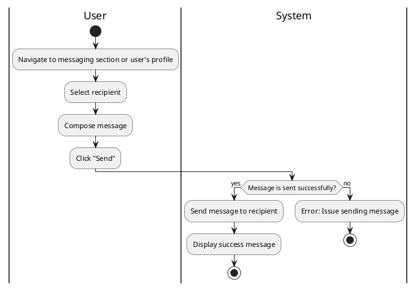

#### Use Case UC-18: Send Message
| ID & Name:         | UC-18: Send Message                                                                                                                                                            |
| ------------------ | ------------------------------------------------------------------------------------------------------------------------------------------------------------------------------ |
| Primary Actor:     | User                                                                                                                                                                           |
| Description:       | User sends a direct message to another user.                                                                                                                                   |
| Trigger:           | User decides to send a message to another user.                                                                                                                                |
| Pre-conditions:    | User is logged into their account.                                                                                                                                             |
| Post-conditions:   | Message is successfully sent to the recipient.                                                                                                                                 |
| Normal Flow:       | 1. User navigates to the messaging section or user's profile.   2. User selects the recipient.   3. User composes the message.   4. User clicks on the "Send" button. |
| Alternative Flows: | None.                                                                                                                                                                          |
| Exceptions:        | **Exception #1:** User encounters errors while sending the message.   1. User receives an error message indicating the issue.   2. User retries the send operation.      |
| Priority:          | Medium                                                                                                                                                                         |

