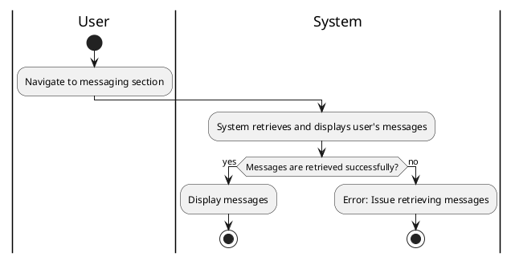

#### Use Case UC-19: View Messages
| ID & Name:         | UC-19: View Messages                                                                                                                            |
| ------------------ | ----------------------------------------------------------------------------------------------------------------------------------------------- |
| Primary Actor:     | User                                                                                                                                            |
| Description:       | User views their messages, including conversations with other users.                                                                            |
| Trigger:           | User accesses the messaging section.                                                                                                            |
| Pre-conditions:    | User is logged into their account.                                                                                                              |
| Post-conditions:   | User successfully views their messages.                                                                                                         |
| Normal Flow:       | 1. User navigates to the messaging section.   2. System retrieves and displays the user's messages.                                          |
| Alternative Flows: | None.                                                                                                                                           |
| Exceptions:        | **Exception #1:** System encounters an error while retrieving the user's messages.   1. User receives an error message indicating the issue. |
| Priority:          | Medium                                                                                                                                          |

