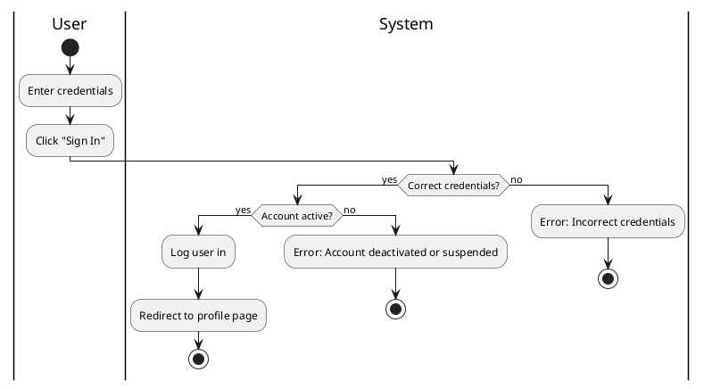

#### Use Case UC-2: Sign In
| ID & Name:         | UC-2: Sign In                                                                                                                                                                                                                                                                                                                 |
| ------------------ | ----------------------------------------------------------------------------------------------------------------------------------------------------------------------------------------------------------------------------------------------------------------------------------------------------------------------------- |
| Primary Actor:     | User                                                                                                                                                                                                                                                                                                                          |
| Description:       | User logs into their account.                                                                                                                                                                                                                                                                                                 |
| Trigger:           | User decides to log in.                                                                                                                                                                                                                                                                                                       |
| Pre-conditions:    | User has already registered for an account.                                                                                                                                                                                                                                                                                   |
| Post-conditions:   | User successfully logs into their account.                                                                                                                                                                                                                                                                                    |
| Normal Flow:       | 1. User enters their username/email and password.   2. User clicks on the "Sign In" button.   3. System verifies the credentials.   4. System logs the user into their account.   5. System redirects the user to their profile page.                                                                             |
| Alternative Flows: | None.                                                                                                                                                                                                                                                                                                                         |
| Exceptions:        | **Exception #1:** User enters incorrect username/email or password.   1. User receives an error message indicating incorrect credentials.   **Exception #2:** User tries to sign in with a deactivated or suspended account.   1. User receives an error message indicating the account is deactivated or suspended. |
| Priority:          | High                                                                                                                                                                                                                                                                                                                          |

