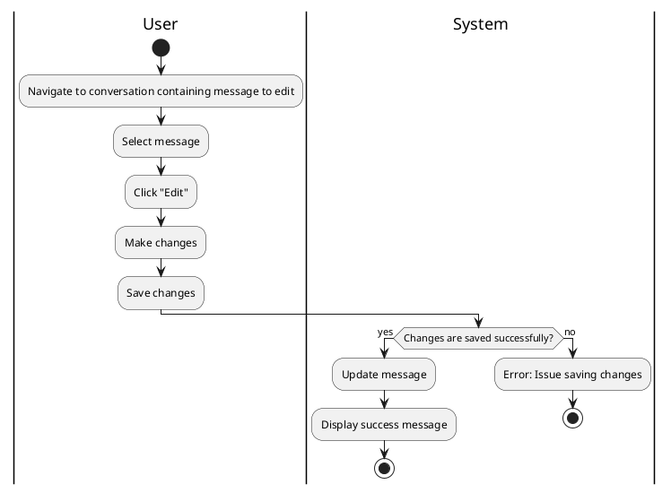

#### Use Case UC-20: Edit Message
| ID & Name:         | UC-20: Edit Message                                                                                                                                                                                                  |
| ------------------ | -------------------------------------------------------------------------------------------------------------------------------------------------------------------------------------------------------------------- |
| Primary Actor:     | User                                                                                                                                                                                                                 |
| Description:       | User edits a previously sent message.                                                                                                                                                                                |
| Trigger:           | User decides to edit a message they previously sent.                                                                                                                                                                 |
| Pre-conditions:    | User is logged into their account and has previously sent the message.                                                                                                                                               |
| Post-conditions:   | Message is successfully edited and updated with the new content.                                                                                                                                                     |
| Normal Flow:       | 1. User navigates to the conversation containing the message they want to edit.   2. User selects the message to edit.   3. User makes desired changes to the message content.   4. User saves the changes. |
| Alternative Flows: | None.                                                                                                                                                                                                                |
| Exceptions:        | **Exception #1:** User encounters errors while saving changes.   1. User receives an error message indicating the issue.   2. User retries the save operation.                                                 |
| Priority:          | Medium                                                                                                                                                                                                               |

