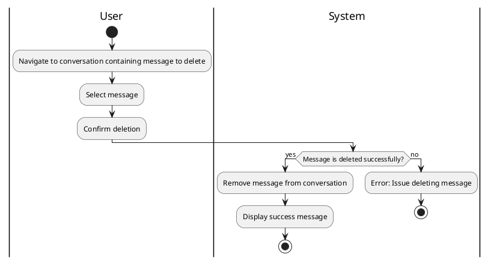

#### Use Case UC-21: Delete Message
| ID & Name:         | UC-21: Delete Message                                                                                                                                                        |
| ------------------ | ---------------------------------------------------------------------------------------------------------------------------------------------------------------------------- |
| Primary Actor:     | User                                                                                                                                                                         |
| Description:       | User deletes a previously sent message.                                                                                                                                      |
| Trigger:           | User decides to delete a message they previously sent.                                                                                                                       |
| Pre-conditions:    | User is logged into their account and has previously sent the message.                                                                                                       |
| Post-conditions:   | Message is successfully deleted and removed from the conversation.                                                                                                           |
| Normal Flow:       | 1. User navigates to the conversation containing the message they want to delete.   2. User selects the message to delete.   3. User confirms the deletion.            |
| Alternative Flows: | None.                                                                                                                                                                        |
| Exceptions:        | **Exception #1:** User encounters errors while deleting the message.   1. User receives an error message indicating the issue.   2. User retries the delete operation. |
| Priority:          | Medium                                                                                                                                                                       |

