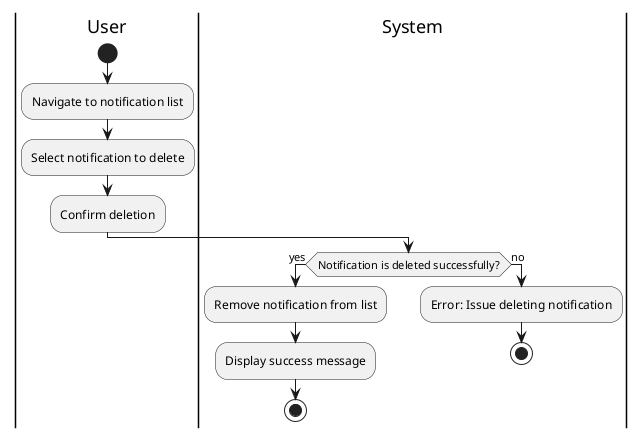

#### Use Case UC-22: Delete Notification
| ID & Name:         | UC-22: Delete Notification                                                                                                                                                        |
| ------------------ | --------------------------------------------------------------------------------------------------------------------------------------------------------------------------------- |
| Primary Actor:     | User                                                                                                                                                                              |
| Description:       | User deletes a notification from their notification list.                                                                                                                         |
| Trigger:           | User decides to delete a notification.                                                                                                                                            |
| Pre-conditions:    | User is logged into their account.                                                                                                                                                |
| Post-conditions:   | Notification is successfully removed from the user's notification list.                                                                                                           |
| Normal Flow:       | 1. User navigates to their notification list.   2. User selects the notification they want to delete.   3. User confirms the deletion.                                      |
| Alternative Flows: | None.                                                                                                                                                                             |
| Exceptions:        | **Exception #1:** User encounters errors while deleting the notification.   1. User receives an error message indicating the issue.   2. User retries the delete operation. |
| Priority:          | Medium                                                                                                                                                                            |

