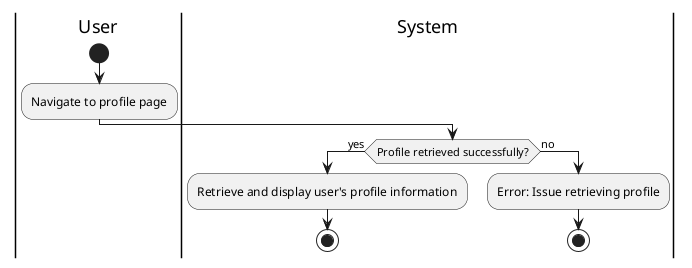

#### Use Case UC-3: View Profile
| ID & Name:         | UC-3: View Profile                                                                                             |
| ------------------ | -------------------------------------------------------------------------------------------------------------- |
| Primary Actor:     | User                                                                                                           |
| Description:       | User views their own profile information.                                                                      |
| Trigger:           | User navigates to the profile page.                                                                            |
| Pre-conditions:    | User is logged into their account.                                                                             |
| Post-conditions:   | User successfully views their profile.                                                                         |
| Normal Flow:       | 1. User navigates to the profile page.     2. System retrieves and displays the user's profile information. |
| Alternative Flows: | None.                                                                                                          |
| Exceptions:        | **Exception #1:** System encounters an error while retrieving the user's profile information.                  |
| Priority:          | Medium                                                                                                         |

