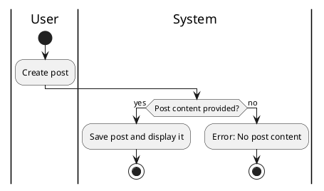

#### Use Case UC-4: Create Post
| ID & Name:         | UC-4: Create Post                                                                                                                                                                                                                                                                                                  |
| ------------------ | ------------------------------------------------------------------------------------------------------------------------------------------------------------------------------------------------------------------------------------------------------------------------------------------------------------------ |
| Primary Actor:     | User                                                                                                                                                                                                                                                                                                               |
| Description:       | User creates a new post to share with others.                                                                                                                                                                                                                                                                      |
| Trigger:           | User decides to create a new post.                                                                                                                                                                                                                                                                                 |
| Pre-conditions:    | User is logged into their account.                                                                                                                                                                                                                                                                                 |
| Post-conditions:   | New post is successfully created and visible to others.                                                                                                                                                                                                                                                            |
| Normal Flow:       | 1. User navigates to the "Create Post" section.   2. User enters post content and attaches media if desired.   3. User clicks on the "Post" button.   4. System saves the post and displays it to the user and others.                                                                                    |
| Alternative Flows: | None.                                                                                                                                                                                                                                                                                                              |
| Exceptions:        | **Exception #1:** User tries to post without entering any content.   1. User receives an error message prompting to enter post content.   **Exception #2:** User encounters a technical issue while posting.   1. User receives an error message indicating the issue and is prompted to try again later. |
| Priority:          | High                                                                                                                                                                                                                                                                                                               |

