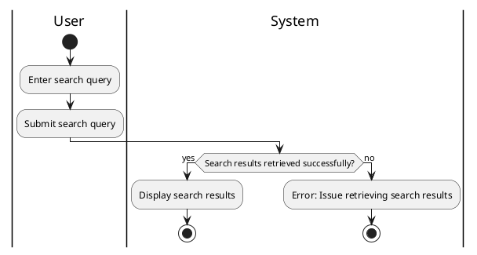

#### Use Case UC-5: Search
| ID & Name:         | UC-5: Search                                                                                                                                                   |
| ------------------ | -------------------------------------------------------------------------------------------------------------------------------------------------------------- |
| Primary Actor:     | User                                                                                                                                                           |
| Description:       | User searches for other users or posts based on specific keywords or criteria.                                                                                 |
| Trigger:           | User decides to perform a search.                                                                                                                              |
| Pre-conditions:    | User is logged into their account.                                                                                                                             |
| Post-conditions:   | Search results matching the query are displayed to the user.                                                                                                   |
| Normal Flow:       | 1. User enters keywords or criteria into the search bar.   2. User submits the search query.   3. System retrieves and displays relevant search results. |
| Alternative Flows: | None.                                                                                                                                                          |
| Exceptions:        | **Exception #1:** System encounters an error while retrieving search results.   1. User receives an error message indicating the issue.                     |
| Priority:          | Medium                                                                                                                                                         |

