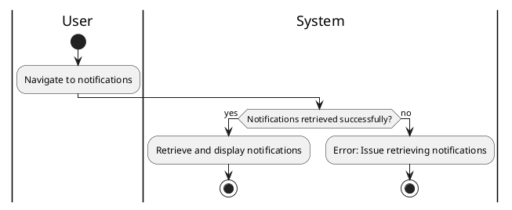

#### Use Case UC-6: View Notifications
| ID & Name:         | UC-6: View Notifications                                                                                                                             |
| ------------------ | ---------------------------------------------------------------------------------------------------------------------------------------------------- |
| Primary Actor:     | User                                                                                                                                                 |
| Description:       | User views notifications related to their account activity, such as new followers, likes, comments, or messages.                                     |
| Trigger:           | User accesses the notifications section.                                                                                                             |
| Pre-conditions:    | User is logged into their account.                                                                                                                   |
| Post-conditions:   | User successfully views their notifications.                                                                                                         |
| Normal Flow:       | 1. User navigates to the notifications section.   2. System retrieves and displays the user's notifications.                                      |
| Alternative Flows: | None.                                                                                                                                                |
| Exceptions:        | **Exception #1:** System encounters an error while retrieving the user's notifications.   1. User receives an error message indicating the issue. |
| Priority:          | Medium                                                                                                                                               |

