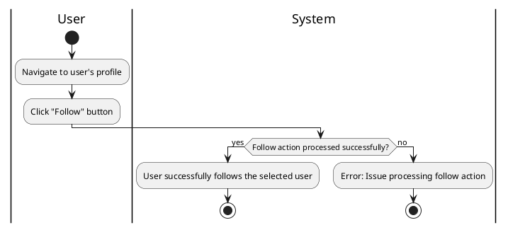

#### Use Case UC-7: Follow User
| ID & Name:         | UC-7: Follow User                                                                                                                             |
| ------------------ | --------------------------------------------------------------------------------------------------------------------------------------------- |
| Primary Actor:     | User                                                                                                                                          |
| Description:       | User follows another user to receive updates on their activity.                                                                               |
| Trigger:           | User decides to follow another user.                                                                                                          |
| Pre-conditions:    | User is logged into their account.                                                                                                            |
| Post-conditions:   | User successfully follows the selected user.                                                                                                  |
| Normal Flow:       | 1. User navigates to the profile of the user they want to follow.   2. User clicks on the "Follow" button.                                 |
| Alternative Flows: | None.                                                                                                                                         |
| Exceptions:        | **Exception #1:** System encounters an error while processing the follow action.   1. User receives an error message indicating the issue. |
| Priority:          | Medium                                                                                                                                        |

