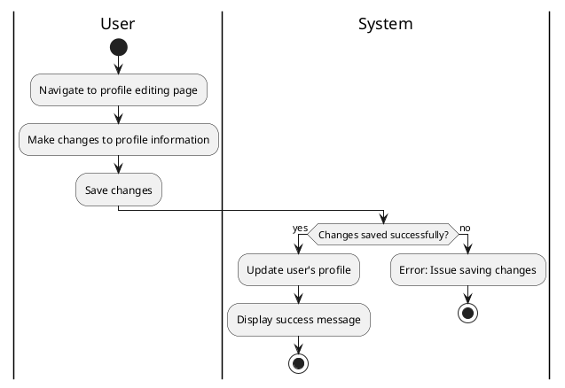

#### Use Case UC-9: Update Profile
| ID & Name:         | UC-9: Update Profile                                                                                                                                                     |
| ------------------ | ------------------------------------------------------------------------------------------------------------------------------------------------------------------------ |
| Primary Actor:     | User                                                                                                                                                                     |
| Description:       | User updates their profile information, such as name, bio, profile picture, or settings.                                                                                 |
| Trigger:           | User decides to edit their profile.                                                                                                                                      |
| Pre-conditions:    | User is logged into their account.                                                                                                                                       |
| Post-conditions:   | User successfully updates their profile.                                                                                                                                 |
| Normal Flow:       | 1. User navigates to the profile settings or edit profile section.   2. User makes desired changes to their profile information.   3. User saves the changes.      |
| Alternative Flows: | None.                                                                                                                                                                    |
| Exceptions:        | **Exception #1:** System encounters an error while saving changes.   1. User receives an error message indicating the issue.   2. User retries the save operation. |
| Priority:          | Medium                                                                                                                                                                   |

