### Use Case Documents

#### Use Case UC-1: Sign Up

| ID & Name:         | UC-1: Sign Up                                                                                                                                                                                                                                                                                                               |
|--------------------|-----------------------------------------------------------------------------------------------------------------------------------------------------------------------------------------------------------------------------------------------------------------------------------------------------------------------------|
| Primary Actor:     | User                                                                                                                                                                                                                                                                                                                        |
| Description:       | User registers for a new account.                                                                                                                                                                                                                                                                                           |
| Trigger:           | User decides to create a new account.                                                                                                                                                                                                                                                                                       |
| Pre-conditions:    | None.                                                                                                                                                                                                                                                                                                                       |
| Post-conditions:   | User successfully registers for an account.                                                                                                                                                                                                                                                                                 |
| Normal Flow:       | 1. User provides required registration information. <br> 2. User clicks on the "Sign Up" button. <br> 3. System creates a new account for the user. <br> 4. System displays a success message.                                                                                                                              |
| Alternative Flows: | None.                                                                                                                                                                                                                                                                                                                       |
| Exceptions:        | **Exception #1:** User provides incomplete or invalid information. <br> 1. User receives an error message prompting to correct the information. <br> **Exception #2:** User tries to sign up with an existing email or username. <br> 1. User receives an error message indicating the email or username is already in use. |
| Priority:          | High                                                                                                                                                                                                                                                                                                                        |

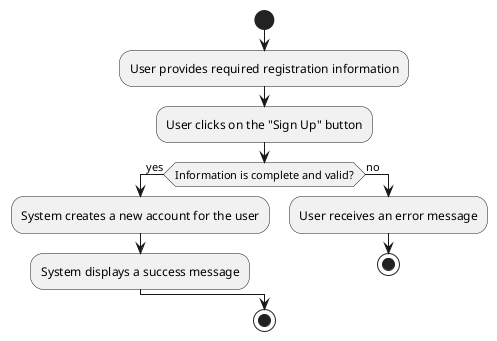

#### Use Case UC-2: Sign In

| ID & Name:         | UC-2: Sign In                                                                                                                                                                                                                                                                                                                 |
|--------------------|-------------------------------------------------------------------------------------------------------------------------------------------------------------------------------------------------------------------------------------------------------------------------------------------------------------------------------|
| Primary Actor:     | User                                                                                                                                                                                                                                                                                                                          |
| Description:       | User logs into their account.                                                                                                                                                                                                                                                                                                 |
| Trigger:           | User decides to log in.                                                                                                                                                                                                                                                                                                       |
| Pre-conditions:    | User has already registered for an account.                                                                                                                                                                                                                                                                                   |
| Post-conditions:   | User successfully logs into their account.                                                                                                                                                                                                                                                                                    |
| Normal Flow:       | 1. User enters their username/email and password. <br> 2. User clicks on the "Sign In" button. <br> 3. System verifies the credentials. <br> 4. System logs the user into their account. <br> 5. System redirects the user to their profile page.                                                                             |
| Alternative Flows: | None.                                                                                                                                                                                                                                                                                                                         |
| Exceptions:        | **Exception #1:** User enters incorrect username/email or password. <br> 1. User receives an error message indicating incorrect credentials. <br> **Exception #2:** User tries to sign in with a deactivated or suspended account. <br> 1. User receives an error message indicating the account is deactivated or suspended. |
| Priority:          | High                                                                                                                                                                                                                                                                                                                          |

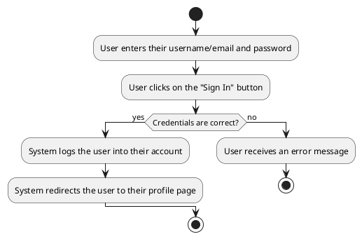

#### Use Case UC-3: View Profile

| ID & Name:         | UC-3: View Profile                                                                                             |
|--------------------|----------------------------------------------------------------------------------------------------------------|
| Primary Actor:     | User                                                                                                           |
| Description:       | User views their own profile information.                                                                      |
| Trigger:           | User navigates to the profile page.                                                                            |
| Pre-conditions:    | User is logged into their account.                                                                             |
| Post-conditions:   | User successfully views their profile.                                                                         |
| Normal Flow:       | 1. User navigates to the profile page.   <br> 2. System retrieves and displays the user's profile information. |
| Alternative Flows: | None.                                                                                                          |
| Exceptions:        | None.                                                                                                          |
| Priority:          | Medium                                                                                                         |

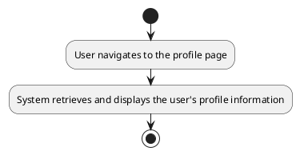

#### Use Case UC-4: Create Post

| ID & Name:         | UC-4: Create Post                                                                                                                                                                                                                                                                                                  |
|--------------------|--------------------------------------------------------------------------------------------------------------------------------------------------------------------------------------------------------------------------------------------------------------------------------------------------------------------|
| Primary Actor:     | User                                                                                                                                                                                                                                                                                                               |
| Description:       | User creates a new post to share with others.                                                                                                                                                                                                                                                                      |
| Trigger:           | User decides to create a new post.                                                                                                                                                                                                                                                                                 |
| Pre-conditions:    | User is logged into their account.                                                                                                                                                                                                                                                                                 |
| Post-conditions:   | New post is successfully created and visible to others.                                                                                                                                                                                                                                                            |
| Normal Flow:       | 1. User navigates to the "Create Post" section. <br> 2. User enters post content and attaches media if desired. <br> 3. User clicks on the "Post" button. <br> 4. System saves the post and displays it to the user and others.                                                                                    |
| Alternative Flows: | None.                                                                                                                                                                                                                                                                                                              |
| Exceptions:        | **Exception #1:** User tries to post without entering any content. <br> 1. User receives an error message prompting to enter post content. <br> **Exception #2:** User encounters a technical issue while posting. <br> 1. User receives an error message indicating the issue and is prompted to try again later. |
| Priority:          | High                                                                                                                                                                                                                                                                                                               |

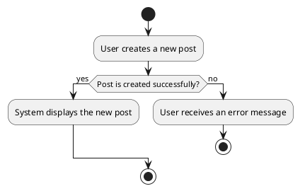

#### Use Case UC-5: Search

| ID & Name:         | UC-5: Search                                                                                                                                                   |
|--------------------|----------------------------------------------------------------------------------------------------------------------------------------------------------------|
| Primary Actor:     | User                                                                                                                                                           |
| Description:       | User searches for other users or posts based on specific keywords or criteria.                                                                                 |
| Trigger:           | User decides to perform a search.                                                                                                                              |
| Pre-conditions:    | User is logged into their account.                                                                                                                             |
| Post-conditions:   | Search results matching the query are displayed to the user.                                                                                                   |
| Normal Flow:       | 1. User enters keywords or criteria into the search bar. <br> 2. User submits the search query. <br> 3. System retrieves and displays relevant search results. |
| Alternative Flows: | None.                                                                                                                                                          |
| Exceptions:        | None.                                                                                                                                                          |
| Priority:          | Medium                                                                                                                                                         |

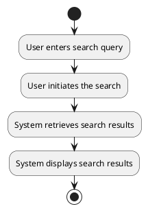

#### Use Case UC-6: View Notifications

| ID & Name:         | UC-6: View Notifications                                                                                         |
|--------------------|------------------------------------------------------------------------------------------------------------------|
| Primary Actor:     | User                                                                                                             |
| Description:       | User views notifications related to their account activity, such as new followers, likes, comments, or messages. |
| Trigger:           | User accesses the notifications section.                                                                         |
| Pre-conditions:    | User is logged into their account.                                                                               |
| Post-conditions:   | User successfully views their notifications.                                                                     |
| Normal Flow:       | 1. User navigates to the notifications section. <br> 2. System retrieves and displays the user's notifications.  |
| Alternative Flows: | None.                                                                                                            |
| Exceptions:        | None.                                                                                                            |
| Priority:          | Medium                                                                                                           |

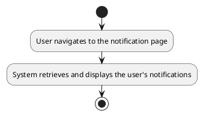

#### Use Case UC-7: Follow User

| ID & Name:         | UC-7: Follow User                                                                                             |
|--------------------|---------------------------------------------------------------------------------------------------------------|
| Primary Actor:     | User                                                                                                          |
| Description:       | User follows another user to receive updates on their activity.                                               |
| Trigger:           | User decides to follow another user.                                                                          |
| Pre-conditions:    | User is logged into their account.                                                                            |
| Post-conditions:   | User successfully follows the selected user.                                                                  |
| Normal Flow:       | 1. User navigates to the profile of the user they want to follow. <br> 2. User clicks on the "Follow" button. |
| Alternative Flows: | None.                                                                                                         |
| Exceptions:        | None.                                                                                                         |
| Priority:          | Medium                                                                                                        |

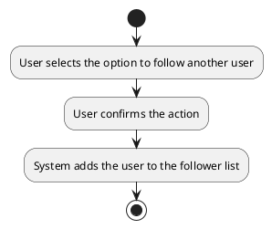

#### Use Case UC-8: Unfollow User

| ID & Name:         | UC-8: Unfollow User                                                                                               |
|--------------------|-------------------------------------------------------------------------------------------------------------------|
| Primary Actor:     | User                                                                                                              |
| Description:       | User unfollows another user, stopping updates on their activity.                                                  |
| Trigger:           | User decides to unfollow another user.                                                                            |
| Pre-conditions:    | User is logged into their account.                                                                                |
| Post-conditions:   | User successfully unfollows the selected user.                                                                    |
| Normal Flow:       | 1. User navigates to the profile of the user they want to unfollow. <br> 2. User clicks on the "Unfollow" button. |
| Alternative Flows: | None.                                                                                                             |
| Exceptions:        | None.                                                                                                             |
| Priority:          | Medium                                                                                                            |

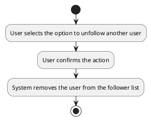

#### Use Case UC-9: Update Profile

| ID & Name:         | UC-9: Update Profile                                                                                                                                                 |
|--------------------|----------------------------------------------------------------------------------------------------------------------------------------------------------------------|
| Primary Actor:     | User                                                                                                                                                                 |
| Description:       | User updates their profile information, such as name, bio, profile picture, or settings.                                                                             |
| Trigger:           | User decides to edit their profile.                                                                                                                                  |
| Pre-conditions:    | User is logged into their account.                                                                                                                                   |
| Post-conditions:   | User successfully updates their profile.                                                                                                                             |
| Normal Flow:       | 1. User navigates to the profile settings or edit profile section. <br> 2. User makes desired changes to their profile information. <br> 3. User saves the changes.  |
| Alternative Flows: | None.                                                                                                                                                                |
| Exceptions:        | **Exception #1:** User encounters errors while saving changes. <br> 1. User receives an error message indicating the issue. <br> 2. User retries the save operation. |
| Priority:          | Medium                                                                                                                                                               |

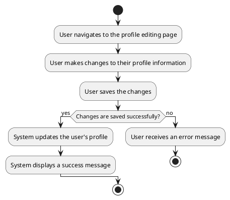

#### Use Case UC-10: View Post

| ID & Name:         | UC-10: View Post                                                                                                                         |
|--------------------|------------------------------------------------------------------------------------------------------------------------------------------|
| Primary Actor:     | User                                                                                                                                     |
| Description:       | User views a post along with its associated comments, reactions, and other details.                                                      |
| Trigger:           | User clicks on a post from the feed or search results.                                                                                   |
| Pre-conditions:    | User is logged into their account.                                                                                                       |
| Post-conditions:   | User successfully views the selected post.                                                                                               |
| Normal Flow:       | 1. User clicks on a post from the feed or search results.<br> 2. System retrieves and displays the selected post along with its details. |
| Alternative Flows: | None.                                                                                                                                    |
| Exceptions:        | None.                                                                                                                                    |
| Priority:          | High                                                                                                                                     |

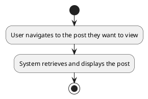

#### Use Case UC-11: Edit Post

| ID & Name:         | UC-11: Edit Post                                                                                                                                                                   |
|--------------------|------------------------------------------------------------------------------------------------------------------------------------------------------------------------------------|
| Primary Actor:     | User                                                                                                                                                                               |
| Description:       | User edits one of their existing posts.                                                                                                                                            |
| Trigger:           | User decides to edit a post they previously created.                                                                                                                               |
| Pre-conditions:    | User is logged into their account.                                                                                                                                                 |
| Post-conditions:   | Post is successfully edited and updated with the new content.                                                                                                                      |
| Normal Flow:       | 1. User navigates to the post they want to edit. <br> 2. User clicks on the "Edit" option. <br> 3. User makes desired changes to the post content. <br> 4. User saves the changes. |
| Alternative Flows: | None.                                                                                                                                                                              |
| Exceptions:        | **Exception #1:** User encounters errors while saving changes. <br> 1. User receives an error message indicating the issue. <br> 2. User retries the save operation.               |
| Priority:          | Medium                                                                                                                                                                             |

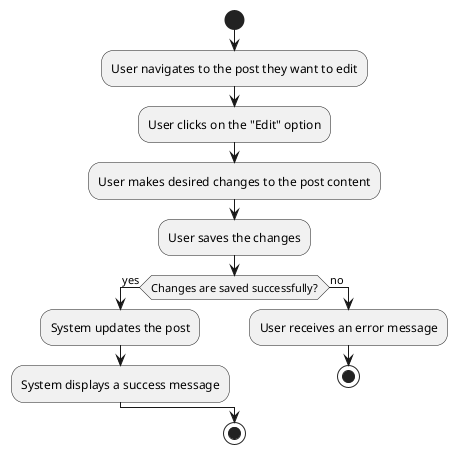

#### Use Case UC-12: Delete Post

| ID & Name:         | UC-12: Delete Post                                                                                                                                                        |
|--------------------|---------------------------------------------------------------------------------------------------------------------------------------------------------------------------|
| Primary Actor:     | User                                                                                                                                                                      |
| Description:       | User deletes one of their existing posts.                                                                                                                                 |
| Trigger:           | User decides to delete a post they previously created.                                                                                                                    |
| Pre-conditions:    | User is logged into their account.                                                                                                                                        |
| Post-conditions:   | Post is successfully deleted and removed from the system.                                                                                                                 |
| Normal Flow:       | 1. User navigates to the post they want to delete. <br> 2. User clicks on the "Delete" option. <br> 3. User confirms the deletion.                                        |
| Alternative Flows: | None.                                                                                                                                                                     |
| Exceptions:        | **Exception #1:** User encounters errors while deleting the post. <br> 1. User receives an error message indicating the issue. <br> 2. User retries the delete operation. |
| Priority:          | Medium                                                                                                                                                                    |

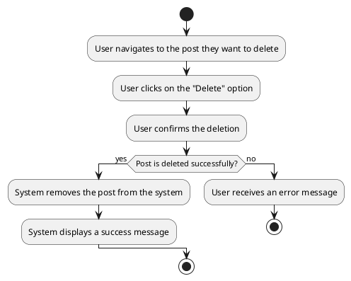

#### Use Case UC-13: Comment on Post

| ID & Name:         | UC-13: Comment on Post                                                                                                                                                       |
|--------------------|------------------------------------------------------------------------------------------------------------------------------------------------------------------------------|
| Primary Actor:     | User                                                                                                                                                                         |
| Description:       | User adds a comment to an existing post.                                                                                                                                     |
| Trigger:           | User decides to comment on a post.                                                                                                                                           |
| Pre-conditions:    | User is logged into their account.                                                                                                                                           |
| Post-conditions:   | Comment is successfully added to the selected post.                                                                                                                          |
| Normal Flow:       | 1. User navigates to the post they want to comment on. <br> 2. User types their comment in the designated comment section. <br> 3. User clicks on the "Post Comment" button. |
| Alternative Flows: | None.                                                                                                                                                                        |
| Exceptions:        | **Exception #1:** User encounters errors while posting the comment. <br> 1. User receives an error message indicating the issue. <br> 2. User retries the comment operation. |
| Priority:          | High                                                                                                                                                                         |

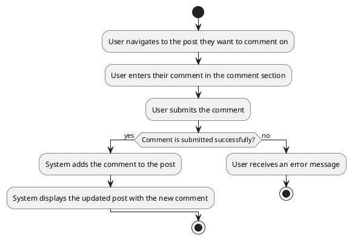

#### Use Case UC-14: Edit Comment

| ID & Name:         | UC-14: Edit Comment                                                                                                                                                                      |
|--------------------|------------------------------------------------------------------------------------------------------------------------------------------------------------------------------------------|
| Primary Actor:     | User                                                                                                                                                                                     |
| Description:       | User edits one of their existing comments on a post.                                                                                                                                     |
| Trigger:           | User decides to edit a comment they previously made.                                                                                                                                     |
| Pre-conditions:    | User is logged into their account.                                                                                                                                                       |
| Post-conditions:   | Comment is successfully edited and updated with the new content.                                                                                                                         |
| Normal Flow:       | 1. User navigates to the comment they want to edit. <br> 2. User clicks on the "Edit" option. <br> 3. User makes desired changes to the comment content. <br> 4. User saves the changes. |
| Alternative Flows: | None.                                                                                                                                                                                    |
| Exceptions:        | **Exception #1:** User encounters errors while saving changes. <br> 1. User receives an error message indicating the issue. <br> 2. User retries the save operation.                     |
| Priority:          | Medium                                                                                                                                                                                   |

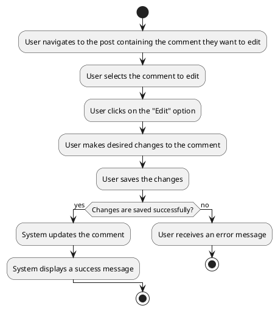

#### Use Case UC-15: Delete Comment

| ID & Name:         | UC-15: Delete Comment                                                                                                                                                        |
|--------------------|------------------------------------------------------------------------------------------------------------------------------------------------------------------------------|
| Primary Actor:     | User                                                                                                                                                                         |
| Description:       | User deletes one of their existing comments on a post.                                                                                                                       |
| Trigger:           | User decides to delete a comment they previously made.                                                                                                                       |
| Pre-conditions:    | User is logged into their account.                                                                                                                                           |
| Post-conditions:   | Comment is successfully deleted and removed from the post.                                                                                                                   |
| Normal Flow:       | 1. User navigates to the comment they want to delete. <br> 2. User clicks on the "Delete" option. <br> 3. User confirms the deletion.                                        |
| Alternative Flows: | None.                                                                                                                                                                        |
| Exceptions:        | **Exception #1:** User encounters errors while deleting the comment. <br> 1. User receives an error message indicating the issue. <br> 2. User retries the delete operation. |
| Priority:          | Medium                                                                                                                                                                       |

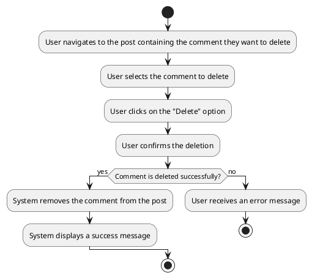

#### Use Case UC-16: React to Post

| ID & Name:         | UC-16: React to Post                                                                                                                                                                                                |
|--------------------|---------------------------------------------------------------------------------------------------------------------------------------------------------------------------------------------------------------------|
| Primary Actor:     | User                                                                                                                                                                                                                |
| Description:       | User reacts to a post by adding a like, dislike, or other emotive response.                                                                                                                                         |
| Trigger:           | User decides to react to a post.                                                                                                                                                                                    |
| Pre-conditions:    | User is logged into their account.                                                                                                                                                                                  |
| Post-conditions:   | User's reaction is successfully added to the selected post.                                                                                                                                                         |
| Normal Flow:       | 1. User clicks on the reaction button (e.g., like, dislike) associated with the post.                                                                                                                               |
| Alternative Flows: | None.                                                                                                                                                                                                               |
| Exceptions:        | **Exception #1:** User encounters errors while adding the reaction. <br> 1. User receives an error message indicating the issue.                                       <br> 2. User retries the reaction operation. |
| Priority:          | Medium                                                                                                                                                                                                              |

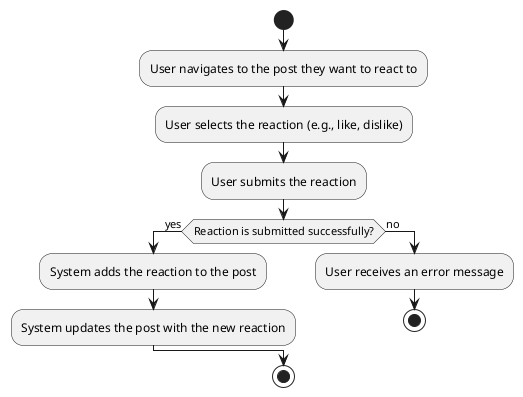

#### Use Case UC-17: Remove Reaction

| ID & Name:         | UC-17: Remove Reaction                                                                                                                                                                                              |
|--------------------|---------------------------------------------------------------------------------------------------------------------------------------------------------------------------------------------------------------------|
| Primary Actor:     | User                                                                                                                                                                                                                |
| Description:       | User removes their reaction (like, dislike, etc.) from a post.                                                                                                                                                      |
| Trigger:           | User decides to remove their reaction from a post.                                                                                                                                                                  |
| Pre-conditions:    | User is logged into their account and has previously reacted to the post.                                                                                                                                           |
| Post-conditions:   | User's reaction is successfully removed from the post.                                                                                                                                                              |
| Normal Flow:       | 1. User clicks on the reaction button (e.g., like, dislike) associated with the post to remove their reaction.                                                                                                      |
| Alternative Flows: | None.                                                                                                                                                                                                               |
| Exceptions:        | **Exception #1:** User encounters errors while removing the reaction. <br> 1. User receives an error message indicating the issue.                                      <br> 2. User retries the removal operation. |
| Priority:          | Medium                                                                                                                                                                                                              |

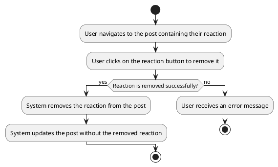

#### Use Case UC-18: Send Message

| ID & Name:         | UC-18: Send Message                                                                                                                                                            |
|--------------------|--------------------------------------------------------------------------------------------------------------------------------------------------------------------------------|
| Primary Actor:     | User                                                                                                                                                                           |
| Description:       | User sends a direct message to another user.                                                                                                                                   |
| Trigger:           | User decides to send a message to another user.                                                                                                                                |
| Pre-conditions:    | User is logged into their account.                                                                                                                                             |
| Post-conditions:   | Message is successfully sent to the recipient.                                                                                                                                 |
| Normal Flow:       | 1. User navigates to the messaging section or user's profile. <br> 2. User selects the recipient. <br> 3. User composes the message. <br> 4. User clicks on the "Send" button. |
| Alternative Flows: | None.                                                                                                                                                                          |
| Exceptions:        | **Exception #1:** User encounters errors while sending the message. <br> 1. User receives an error message indicating the issue. <br> 2. User retries the send operation.      |
| Priority:          | Medium                                                                                                                                                                         |

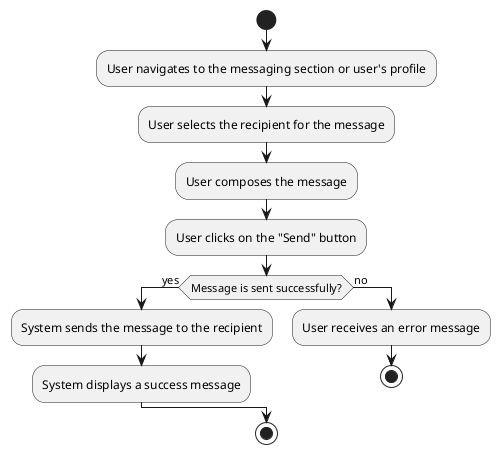

#### Use Case UC-19: View Messages

| ID & Name:         | UC-19: View Messages                                                                                   |
|--------------------|--------------------------------------------------------------------------------------------------------|
| Primary Actor:     | User                                                                                                   |
| Description:       | User views their messages, including conversations with other users.                                   |
| Trigger:           | User accesses the messaging section.                                                                   |
| Pre-conditions:    | User is logged into their account.                                                                     |
| Post-conditions:   | User successfully views their messages.                                                                |
| Normal Flow:       | 1. User navigates to the messaging section. <br> 2. System retrieves and displays the user's messages. |
| Alternative Flows: | None.                                                                                                  |
| Exceptions:        | None.                                                                                                  |
| Priority:          | Medium                                                                                                 |

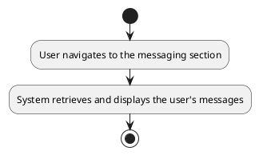

#### Use Case UC-20: Edit Message

| ID & Name:         | UC-20: Edit Message                                                                                                                                                                                                  |
|--------------------|----------------------------------------------------------------------------------------------------------------------------------------------------------------------------------------------------------------------|
| Primary Actor:     | User                                                                                                                                                                                                                 |
| Description:       | User edits a previously sent message.                                                                                                                                                                                |
| Trigger:           | User decides to edit a message they previously sent.                                                                                                                                                                 |
| Pre-conditions:    | User is logged into their account and has previously sent the message.                                                                                                                                               |
| Post-conditions:   | Message is successfully edited and updated with the new content.                                                                                                                                                     |
| Normal Flow:       | 1. User navigates to the conversation containing the message they want to edit. <br> 2. User selects the message to edit. <br> 3. User makes desired changes to the message content. <br> 4. User saves the changes. |
| Alternative Flows: | None.                                                                                                                                                                                                                |
| Exceptions:        | **Exception #1:** User encounters errors while saving changes. <br> 1. User receives an error message indicating the issue. <br> 2. User retries the save operation.                                                 |
| Priority:          | Medium                                                                                                                                                                                                               |

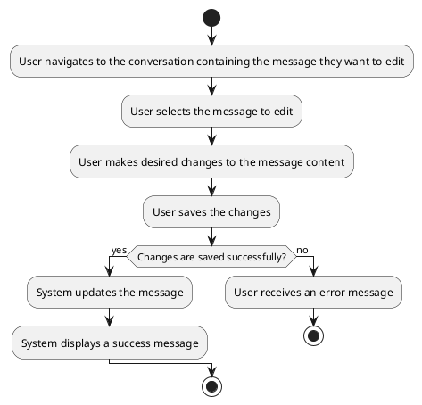

#### Use Case UC-21: Delete Message

| ID & Name:         | UC-21: Delete Message                                                                                                                                                        |
|--------------------|------------------------------------------------------------------------------------------------------------------------------------------------------------------------------|
| Primary Actor:     | User                                                                                                                                                                         |
| Description:       | User deletes a previously sent message.                                                                                                                                      |
| Trigger:           | User decides to delete a message they previously sent.                                                                                                                       |
| Pre-conditions:    | User is logged into their account and has previously sent the message.                                                                                                       |
| Post-conditions:   | Message is successfully deleted and removed from the conversation.                                                                                                           |
| Normal Flow:       | 1. User navigates to the conversation containing the message they want to delete. <br> 2. User selects the message to delete. <br> 3. User confirms the deletion.            |
| Alternative Flows: | None.                                                                                                                                                                        |
| Exceptions:        | **Exception #1:** User encounters errors while deleting the message. <br> 1. User receives an error message indicating the issue. <br> 2. User retries the delete operation. |
| Priority:          | Medium                                                                                                                                                                       |

```plantuml
@startuml
start
:User navigates to the conversation containing the message they want to delete;
:User selects the message to delete;
:User confirms the deletion;
if (Message is deleted successfully?) then (yes)
  :System removes the message from the conversation;
  :System displays a success message;
else (no)
  :User receives an error message;
  stop
endif
stop
@enduml
```

#### Use Case UC-22: Delete Notification

| ID & Name:         | UC-22: Delete Notification                                                                                                                                                        |
|--------------------|-----------------------------------------------------------------------------------------------------------------------------------------------------------------------------------|
| Primary Actor:     | User                                                                                                                                                                              |
| Description:       | User deletes a notification from their notification list.                                                                                                                         |
| Trigger:           | User decides to delete a notification.                                                                                                                                            |
| Pre-conditions:    | User is logged into their account.                                                                                                                                                |
| Post-conditions:   | Notification is successfully removed from the user's notification list.                                                                                                           |
| Normal Flow:       | 1. User navigates to their notification list. <br> 2. User selects the notification they want to delete. <br> 3. User confirms the deletion.                                      |
| Alternative Flows: | None.                                                                                                                                                                             |
| Exceptions:        | **Exception #1:** User encounters errors while deleting the notification. <br> 1. User receives an error message indicating the issue. <br> 2. User retries the delete operation. |
| Priority:          | Medium                                                                                                                                                                            |

```plantuml
@startuml
start
:User navigates to their notification list;
:User selects the notification they want to delete;
:User confirms the deletion;
if (Notification is deleted successfully?) then (yes)
  :System removes the notification from the list;
  :System displays a success message;
else (no)
  :User receives an error message;
  stop
endif
stop
@enduml
```

### Use Case Diagram

```plantuml
@startuml use case
left to right direction
actor User

rectangle "Social Media" {
    User -- (Sign Up)
    User -- (Sign In)
    User -- (View Profile)
    User -- (Create Post)
    User -- (Search)
    User -- (View Notifications)
    User -- (Follow User)
    User -- (Unfollow User)
    (View Profile) ..> (Update Profile) : <<include>>
    (Create Post) ..> (View Post) : <<extends>>
    (View Post) ..> (Edit Post) : <<include>>
    (View Post) ..> (Delete Post) : <<include>>
    (View Post) ..> (Comment on Post) : <<include>>
    (Comment on Post) ..> (Edit Comment) : <<include>>
    (Comment on Post) ..> (Delete Comment) : <<include>>
    (View Post) ..> (React to Post) : <<include>>
    (React to Post) ..> (Remove Reaction) : <<include>>
    (View Post) ..> (Send Message) : <<include>>
    (Send Message) ..> (View Messages) : <<include>>
    (View Messages) ..> (Edit Message) : <<include>>
    (View Messages) ..> (Delete Message) : <<include>>
    (View Notifications) ..> (Delete Notification) : <<include>>
}
@enduml
```
